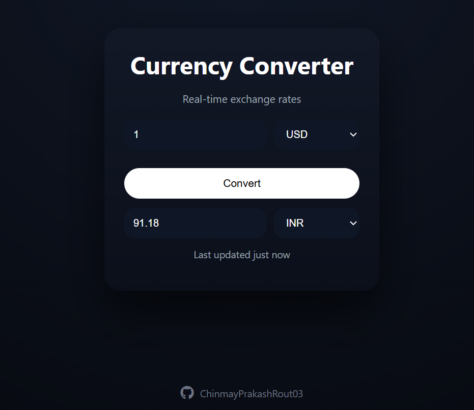

# Day 2 – Real-Time Currency Converter

## 📌 Project Overview
This project is my Day 2 submission for the **30 Days – 30 Projects** challenge.

It is a real-time currency converter web application that fetches live exchange rates using an external API and performs instant conversions between global currencies.

The application features a clean, calculator-style UI and dynamic currency selection.

---

## ❓ Why I Built This
I chose to build a currency converter to:

- Work with real-time API integration
- Understand asynchronous JavaScript (fetch/async/await)
- Handle dynamic data rendering
- Improve error handling and input validation
- Design a modern, responsive interface

---

## 🎯 Key Features
- Real-time exchange rate conversion
- Supports multiple global currencies
- Dynamic currency dropdown population
- Auto-update on input or currency change
- Error handling for invalid inputs or API failures
- Clean calculator-style UI design

---

## 🛠 Tech Stack
- HTML
- CSS
- JavaScript (Vanilla JS)
- ExchangeRate API

---

## 🌍 Impact
This project demonstrates:

- API integration skills
- Dynamic DOM manipulation
- Asynchronous JavaScript handling
- Clean UI/UX design implementation
- Practical real-world application development

---

## 🖼 Preview

---

## 👤 Author
**Chinmay Prakash Rout**  

30 Days – 30 Projects | Day 2

